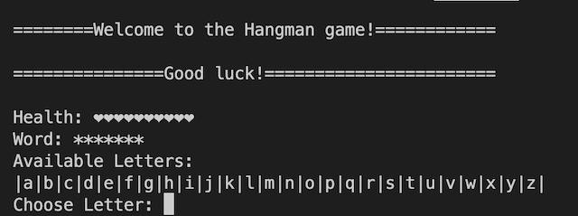

<h1 align="center" id="title">Introduction to Hangman game</h1>

<p id="description">The Hangman is a classic game where a player needs to guess a word where all the letters are masked. The player has a certain number of attempts and needs to select a letter: if the selected letter is part of the word all the locations with the selected letter are unmasked on the other hand if the selected letter is not contained in the word then the number of attempts of the player decreases by one. The player wins if finds the word within the number of attempts and loses otherwise.</p>

<h2>Project Screenshot:</h2>



<h2>🛠️ Installation Steps:</h2>

<p>1. Clone project from GitHub link</p>

```
git clone https://github.com/newvaldas/hangman_terminal_game.git
```

<p>2. Set up the virtual environment</p>

```
python3 -m venv venv                    # create a virtual env in the folder `venv`
source venv/bin/activate                # activate the virtual env
pip install --upgrade pip               # securely upgrade pip
pip install -r requirements.txt         # install dependencies
```

<p>3. Run game with this command</p>

```
python3 hangman.py
```
